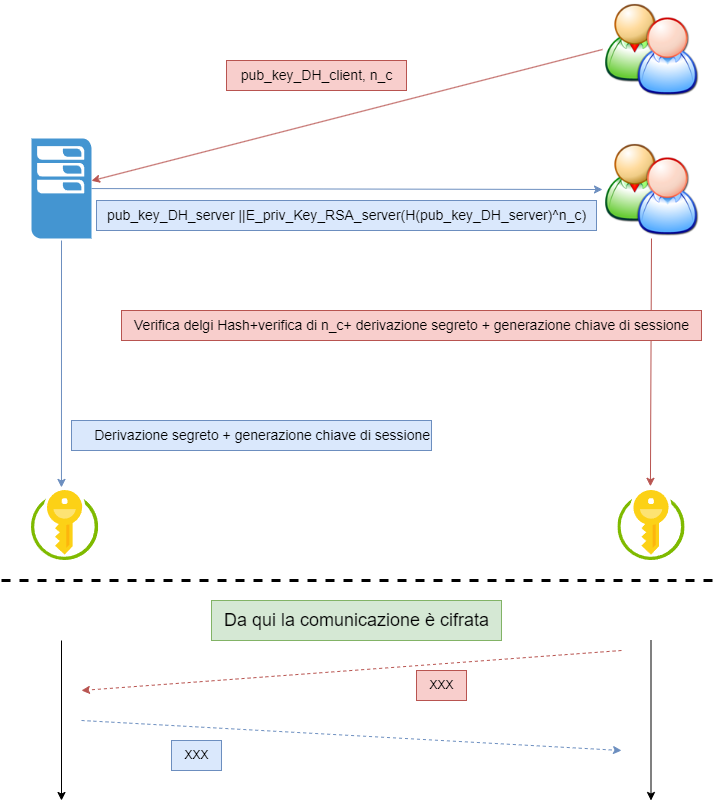
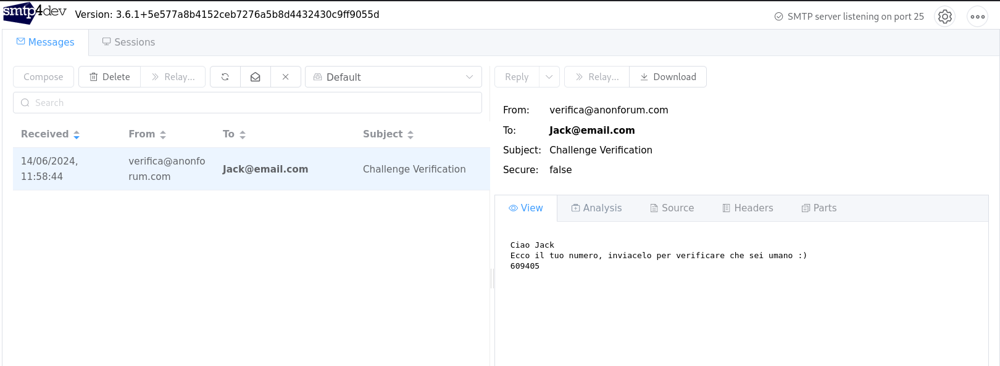

# Crypto_project

Through this project I aim at explaining few concepts about cryptography I have learnt along the way. 
It is NOT a programming excercise, I am not showcasing my ability in writing C code (not much, sry) , it is out of scope. What I want to explain are few cool concepts I understood while programming using OpenSSL.

This project has been developed with the help of Davide Di Rocco, a colleague of mine.

## Project Details

Me and my friend have been asked to code a Bullettin Board System: a place where users register, login and post what they are thinking; the hard part is the security requirements 
the project has to fullfil.

+ Never store or transmit passwords in the clear.
+ Fulfill confidentiality, integrity, no-replay, and non-malleability in communications.
+ Guarantee perfect forward secrecy (PFS).

Seems fun, let's start.

## BOM: Bill of Materials

### Password storage

First things first: how do you guarantee that passwords are not stored in the clear? Exactly! **HASH**

What we did is hashing the pw created by the users with **SHA-256** and salting them with a random salt generated.

How did we gerate a random salt? We used the **[1]arc4random_uniform()** function. Thsi function is found in BSD library and uses the ChaCha20 stream cipher.

What is cool to note here is the usage of **salt**. It is a random string that gets added to the password before it gets hashed. This way, if someone gets access to a db it is not possible to tell if 2 users have the same passwords, given that the salt was different (random).

Salting makes brute force attack more complex because for every combination of the password you need to add every combination of the salt, so a b-bit long salt adds 2^b complexity.
In addition, salting makes **Dictionary attacks** and **Rainbow-Table** attacks more difficult to pursue.

### Data in transit

After establishing a secure session, client and servers start exchanging data. How do we secure the data flow? We use **AES-GCM 128 bit***. GCM is an encryption mode for AES that
stands for Galois Counter Mode. It guarantees confidentiality and authentication of the messages since is uses TAGS that are computed at the receiving end against the ones received 
to see if the data sent is the same as the data received. It also guarantees authentication for messages not intended to be ecnrypted (AAD) but we do not use it in this way.

## Key Agreement and Key Exchange protocol

Here it comes the best part. Since we must gurantee Perfect Forward Secrecy and protection against MiTM and Replay attack, we devised a method that incorporate a sort of ***digital signature*** and ***Ephemeral Diffie-Hellman*** for key derivation.

It is important to note that some of the initial assumptions were the fact that the client already knows the public key (RSA) of the server and we don't need to do do client authentication at the key level, just to implement it via a registration form (more on that later).

+ **First challenge** --> Authenticate the server w.r.t to the client so that an attacker can't do the MiTM attack.

  Since both client and server need to exchange their Diffie Hellman publi key parameters in order to derive the **secret epheemral session key**, we want to make sure that the server
  public DH parameters have their integrity guarateed.

  We do this by concatenating them with their hash signed by the server private key(RSA). This way the client, when receiving them, can "decrypt" the hash with the sever public key(RSA)
  and then compute the hash of what he received to check it againts the hash he received.

  This method guarantees protection against MiTM attack. It will be clear once you'll see the figure of the protocol.

+ **Second challenge** --> Guarantee protection against Replay attack.
  
  To be compliant to this requirement we implement an exchange of a **client_nonce** so that when the server replies with all the things I wrote in the previouse section, the client       knows it is about this actual session.

  
  
## Actual key derivation protocol

  Now it is the time to discuss the actual key derivation algo. Since we need to provide Perfect Forward Secrecy, the Ephemeral Diffie Hellman key exchange derives a different session     key for...you guessed it, every session.

  
  

## Cool feature

Since it was asked to implement a sort of challenge-response for the client at the moment of registration, we thought of adding a random code sent from the server to the client.
If the user  didn't input the correct code sent to his email address, the rgistration phase would stop.

 We used [2]SMTP4dev to run a dummy SMTP server in a docker container that would intercept all the email going out( even the fake one) and display them in a fancy web panel.

 

  

## References
[1]https://man.openbsd.org/arc4random
[2]https://github.com/rnwood/smtp4dev

